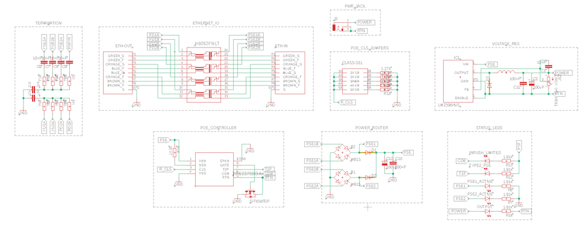
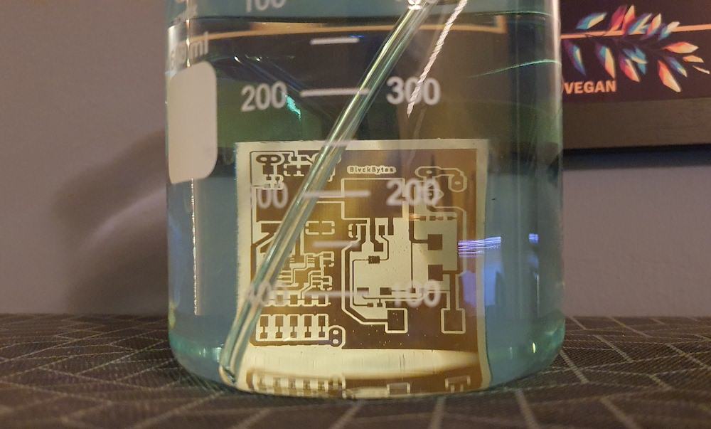
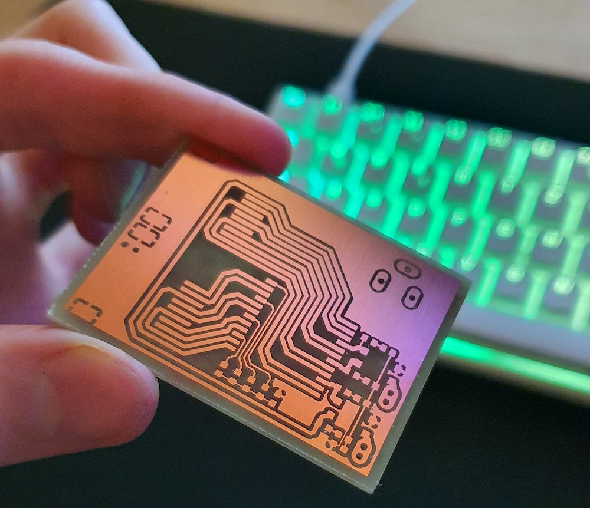
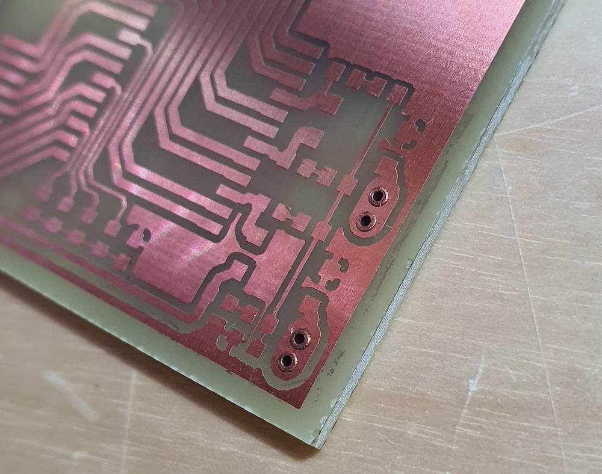

# gbit-poe-splitter

Power devices which don't support PoE and fine-adjust the received voltage at the same time. This equipment conforms to the *802.3at* standard, also known as *PoE+*.

⚠️ This project is far from being done, and I'm just planning things out at this point in time.

## Table of Contents

* [Goals](#goals)
* [Introduction](#introduction)
  * [802\.3af (PoE)](#8023af-poe)
  * [802\.3at (PoE\+)](#8023at-poe)
  * [802\.3bt (Hi\-PoE, PoE\+\+)](#8023bt-hi-poe-poe)
* [Concept](#concept)
* [Features](#features)
  * [Ports](#ports)
  * [Settings](#settings)
  * [Status LEDs](#status-leds)
* [Parts](#parts)
* [Prototyping](#prototyping)

## Goals

* ✅ Small footprint PCB
* ✅ Max budget of 15 Euros
* ✅ Support up to 60V of input
* ✅ Selectable output voltage
* ✅ Selectable PoE class
* ✅ Highest possible current throughput
* ✅ Indication of active type 2
* ✅ DC Output Jack
* ✅ Proper centertap-termination

## Introduction

PoE is short for *Power over Ethernet* and will allow to transmit the needed power for devices on the other end of the CAT-X cable. This is especially of interest for already existing infrastructure, where it's just not economical to run a separate power wire. The only drawbacks are that there's a limit to how much energy can be transmitted and that you might experience a voltage-drop and thus an energy-loss over longer distances of wire.

### 802.3af (PoE)

This standard adds power-delivery to *802.3*, with up to *15.4W* at the output of the power sourcing equipment (PSE), using two twisted-pairs for injection. After calculating the average real world losses over the wire , the consumer only receives around *12.95W* of power. There are also lower power-classes, which are not the default and need to be registered for by the powered device (PD) explicitely.

| Class | Min Power (at PD, [W]) | Max Power (at PD, [W]) |
|:------|:----------|:----------|
| 0 | 0.44 | 12.95 |
| 1 | 0.44 | 3.84 |
| 2 | 3.84 | 6.49 |
| 3 | 6.49 | 12.95 |

### 802.3at (PoE+)

Since *802.3af* is not sufficient for some standard usecases, *802.3at* bumps it up a notch, while still using only two twisted-pairs. Now, PDs can receive up to *25.5W*, which should be plenty for switches, access-points, VOIP, card-readers and so on and so forth.

| Class | Min Power (at PD, [W]) | Max Power (at PD, [W]) |
|:------|:----------|:----------|
| 4 | 12.95 | 25.5 |

### 802.3bt (Hi-PoE, PoE++)

In order to meet the higher demand of power in special cases, IEEE came up with this standard at the end of 2018. Instead of two pairs, it uses all four pairs for power delivery, which will allow up to **100 watts**. Power loss gets cut in half, at least in theory. Since this standard requires more expensive technology, it's not covered by this project.

## Concept

There are several [requirements](https://www.ieee802.org/3/poep_study//email/pdf00005.pdf) to the PD, if it wants to consume *802.3at*.

The main component is represented by the [H6062NL](https://eu.mouser.com/ProductDetail/Pulse-Electronics/H6062NL?qs=hlTQ6wBu%252Bnnq8WII%2F92SGQ%3D%3D), which is a signal transformer that supports up to *1000Base-T*. It consits of four individual isolation transformers, which offer a center-tap for power delivery purposes, where one transformer corresponds to one twisted pair, to fully isolate the PD.

In order to support detection, classification, inrush-current limiting and short-circuit protection, I decided on the [TPS2379](https://www.ti.com/lit/ds/symlink/tps2379.pdf?ts=1636211997743&ref_url=https%253A%252F%252Fwww.google.com%252F). It supports up to *1A* of operating current, which should be plenty, and can even be extended using an external mosfet.

To tap the available power from either one of the two pairs, and to handle reverse-polarity situations, two full bridge rectifiers are inserted directly inbetween the transformers and the control-IC. The output voltage will then be fed through a buck-converter, to easily regulate it. [LM2596HV](http://hmsemi.com/downfile/LM2596HV.PDF) seems to be a perfect fit for this job.

### Detection

The PSE constantly pulses a 4-point detection signal on the port in question, which starts out `LOW` and then rises `HIGH` two times. With the known voltage potential, and the measurable current draw, the PSE calculates the inner resistance of the connected PD. It has to `23.75kOhm < R < 26.25kOhm`, to be a valid PoE device.

### Classification

After passing detection, the PD has to specify it's desired power class to the PSE. The PSE sends signals between 14.5V and 20.5V, while the PD removes R_DET from the line and applies R_CLS, in series with a constant 2.5V regulator. This way, the PSE can accurately measure the current flowing through R_CLS, and thus determine the desired class.

After completing both steps successfully, power is activated.

## Features

### Ports

* Ethernet in (from PSE)
* Ethernet out (to non-PD)
* Standard DC-jack to supply power

### Settings

* 5 positions for class 0-4
* Voltage regulation potentiometer

### Status LEDs

* Power available (Green)
* Inrush current limiting (Yellow)
* Type 2 active (Yellow)
* Pair 1 & 2 hot (Red)
* Pair 3 & 4 hot (Red)

## Parts

| Part | Description | Shop | Price/Pice | Amount | Total |
|:-----|:------------|:-----|:-----------|:-------|:------|
| **Integrated Circuits** |
| H6062NL | Signal Transformer | Mouser | 4.27€ | 1 | 4.27€ |
| TPS2379 | 802.3af PD Interface | Mouser | 2.35€ | 1 | 2.35€ |
| MB1S-TP | Bridge Rectifier | Mouser | 0.26€ | 2 | 0.52€ |
| LM2596HV | [Regulator & aux. Components](https://de.aliexpress.com/item/32916300929.html?spm=a2g0s.9042311.0.0.55414c4dqviJXF) | AliExpress | 1.12€ | 1 | 1.12€ |
| SI7454FDP-T1-RE3 | N-Channel Mosfet | Mouser | 0.69€ | 1 | 0.69€ |
| **Connectors** |
| RJLSE4118101 | RJ45 8P8C Shielded | Mouser | 0.91€ | 2 | 1.82€ |
| PRT-10811 | 5.5mm DC Jack | Mouser | 0.81€ | 1 | 0.81€ |
| **Status LEDs** |
| RC0603FR-071K91L | 1.91k Ohm 0603 | Mouser | 0.008€ | 5 | 0.032€ |
| 150060GS75000 | LED Green 0603 | Mouser | 0.12€ | 1 | 0.12€ |
| 150060GS75000 | LED Yellow 0603 | Mouser | 0.12€ | 2 | 0.24€ |
| 150060GS75000 | LED Red 0603 | Mouser | 0.12€ | 2 | 0.24€ |
| **Filtering & Termination** |
| RC0603FR-0775RL | 75 Ohm 0603 | Mouser | 0.006€ | 8 | 0.012€ |
| CL10B103KO8NNNC | 10nF 0603 | Mouser | 0.011€ | 4 | 0.044€ |
| C0805C104K8RACAUTO | 100nF 0805 | Mouser | 0.058€ | 1 | 0.058€ |
| CL10C102JB8NNND | 1nF 0603 | Mouser | 0.016€ | 2 | 0.032€ |
| **PoE Class (R_CLS)** |
| RC0603FR-071K27L | 1.27k Ohm 0603 | Mouser | 0.008€ | 1 | 0.008€ |
| CR0603-FX-2430ELF | 243 Ohm 0603 | Mouser | 0.016€ | 1 | 0.016€ |
| ERJ-3EKF1370V | 137 Ohm 0603 | Mouser | 0.014€ | 2 | 0.014€ |
| CR0603-FX-90R9ELF | 90.9 Ohm 0603 | Mouser | 0.013€ | 1 | 0.013€ |
| CR0603-FX-63R4ELF | 63.4 Ohm 0603 | Mouser | 0.013€ | 1 | 0.013€ |
| SX1100-A | Jumper Shunt | Mouser | 0.03€ | 1 | 0.03€ |
| 54202-T0803AB01LF | Jumper Pins 2x5 | Mouser | 0.65€ | 1 | 0.65€ |
| **R_DEN** |
| RK73H1JTTDD2492F | 24.9k Ohm 0603 | Mouser | 0.01€ | 1 | 0.01€ |
| **Miscellaneous** |
| RK73B1JTTD204J | 200k Ohm 0603 | Mouser | 0.008€ | 1 | 0.008€ |
| GS2M-LTP | Rectifier Diode | Mouser | 0.28€ | 2 | 0.56€ |
| ACP 6-SMD 10K | SMD Trimmer | Reichelt AT | 0.30€ | 1 | 0.30€ |

Current total: 13.97€, not **yet** including: PCB material

## Prototyping

07.11.2021:

I wanted to check if I could extract power using only the transformer, like some people managed to do online, with no additional logic. After finding an old gigabit-capable router in my basement, I disassembled it and unsoldered one of it's internal transformators ([G4802CG](https://media.digikey.com/pdf/Data%20Sheets/Mentech%20PDFs/G4802CG.pdf)). I also tried one from a 100M model, which didn't work, because they've joined up the centertaps on neighboring coils. The pins were so small that a breakout-board was necessary. This was my test-setup:

On the left, the PSE is connected, where the power gets extracted, and on the right, it's my laptop (PD). I'm using a `Netgear GS305P`, and nope, it's not directly spitting out power without additional logic. I actually discovered that it pulses a few volts on all ports, no matter if something is connected or not. I guess that's where the PD would use load modulation to register itself and it's desired power-class. Now I'm waiting to receive my mouser-order to continue with this test-setup, until the first prototype is up and working, only then will I create a full PCB-layout.

Just in case you're wondering, here's whats inside the IC, I think it looks wonderful:

09.11.2021:

Yesterday and today I finally created all missing footprints and symbols to create the first revision of the schematic. I tried to keep it organized through grouping by functional blocks, as you usually do. Still need to revise it, before I go into routing the board.

Now that the schematic is done, I started on some small parts of routing. I kinda want to have the ethernet ports on one side of the board next to each other, and the DC jack vis-a-vis. The ethernet signal lines are basically just passed through the transformer, which should be done in a short and "bus-like" fashion.

I'm quite happy with my current layout, since the power lines are now exposed at the right hand side, while the PD-side termination is on the left, where it fits nicely.

To improve power delivering capabilities, I now increased all ethernet related traces up to the width of the port's pins. Since my configuration also allows four pair powering, the only thing I might need to change down the road would be the PoE interfacing chip.

I'm planning to keep a GND-plane on top, and a PSE-Power-plane on the bottom, where I'm also going to squeeze in all components that are unrouted right now. This will be quite a challenge for me!

10.11.2021:

The board is completely routed out now, all airwires have been connected. Looks quite nice so far, I don't think that I can squeeze it any tighter without going down yet another rabbit-hole. IMO the pads of the PoE controller seem pretty slim, I will have to thicken them up in the library's footprint.

After correcting other small mistakes, the first physical prototype has been created.

First, I created a double-sided "pouch" out of two overhead projector sheets, having the printed (toner) sides facing together. To block out most tiny holes, I overlayed two sheets of each side. My trusty `HP LaserJet 1200` did a great job again.

After exposing, I developed the foto-resist and then etched away unmasked sections using [sodium persulfate](https://solectroshop.com/en/grabado-de-circuito/455-1kg-de-persulfato-de-sodio-pcb-etchant-para-circuitos-impresos.html).

Quite pleased with the result, although I still need to continuity-check it using my multimeter.

Thankfully I managed to only need through-holes for 6 vias and the DC jack. I hate drilling, it's extremely hard to pull off accurately on such a scale. The holes on both sides lined up perfectly tho, I'm extremely happy about that, in contrast to the riviting work. The rivets suck, but I measured their resistance, and it seems to work out at around 2 Ohm. I need to research this further to come up with a more professional solution. Also, note to self: Only rivet through full planes for power transmission, as the pad-ring gets partially cut off when drilling.

